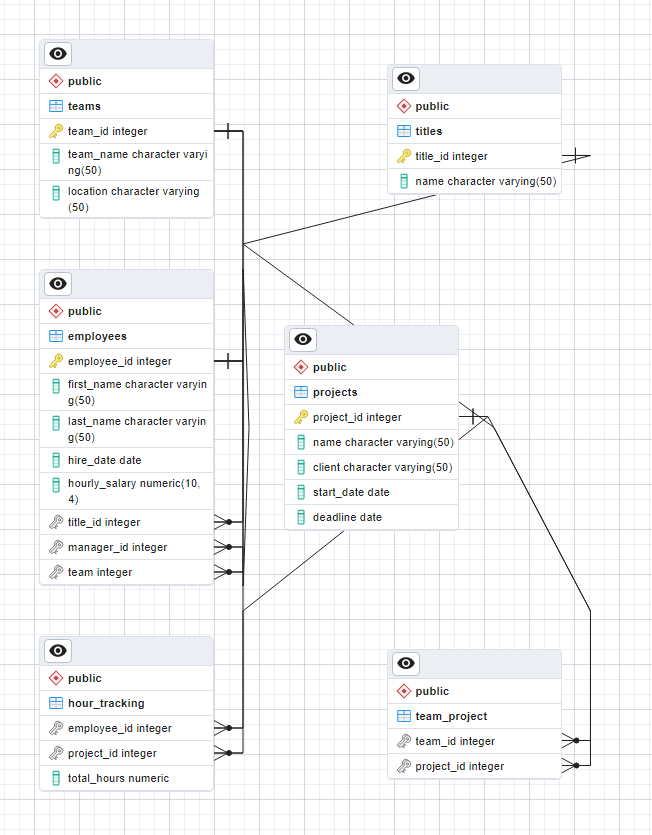

## PostgreSQL Practice Assignment
---
The purpose of this assignment was to practice various PostgreSQL clauses, constraints, joins, subqueries, and aggregations using the provided database schema. 

### Technologies and Tools Used:

- PostgreSQL
- pgAdmin
- SQL queries
---
### ERD diagram from pgAdmin:

